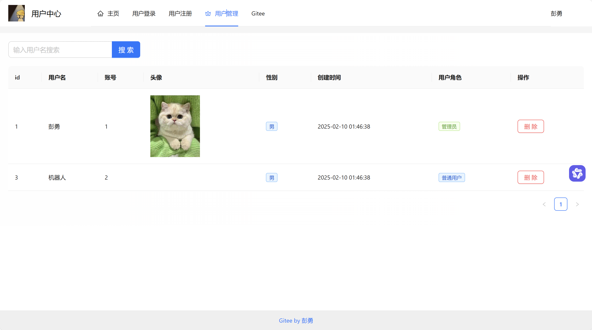

# 简单用户管理

基于 .NET8 Web API+ Vue3 的简单用户管理，前后端分离，实现了用户注册、登录、查询管理等功能。

前端代码地址：https://gitee.com/pengyong2333/user-center-frontend-vue

# 项目概述

后端：
- 基于 .NET8 Web API 和 EF Core：Database First
- 采用三层架构
- 使用 Session+Cookie 维持用户登录态
- 定义泛型仓储，复用大多数通用方法
- 自定义异常类，并封装了全局异常处理中间件
- 定义通用返回对象
- 对象映射：Mapster

前端：
- Vue3+TypeScript
- Vue Router
- 使用Pinia做为状态管理库
- 使用Ant Design 开发页面
- 使用Axios做为网络请求库

# 主要功能主界面

系统用户分为普通用户和管理员，注册默认为普通用户，管理员拥有用户管理功能权限。

# 线上地址
后端AIP：http://118.31.13.93/swagger/index.html
前端地址：http://118.31.13.93:8081/

